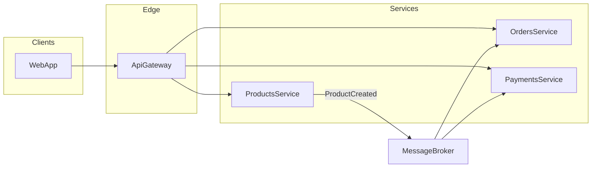

# Products API + Angular client

Small .NET 8 Web API for products (JWT, in-memory store) and an Angular app that talks to it through a dev proxy.

## Prerequisites

- [.NET 8 SDK](https://dotnet.microsoft.com/download)
- [Node.js](https://nodejs.org/) **20.19+**, **22.12+**, or **24+** (required by Angular 21 for the client)
- **Visual Studio 2022+** on Windows: install the **JavaScript and TypeScript** workload if you want [client/client.esproj](client/client.esproj) to load in Solution Explorer when you open [Products.slnx](Products.slnx)

## Run the API

```bash
dotnet run --project Products.Api --launch-profile https
```

Default HTTPS URL: `https://localhost:7007`  
Swagger: `https://localhost:7007/swagger`

Anonymous: `GET /health`  
Get a JWT: `POST /api/auth/token` (empty JSON body is fine)  
Products: `GET/POST /api/products` with header `Authorization: Bearer <accessToken>`  
Optional query: `GET /api/products?colour=Red` (case-insensitive)

## Run tests

```bash
dotnet test
```

## Run the Angular client

Use the **https** API profile so the proxy target matches `https://localhost:7007`.

```bash
cd client
npm install
npm start
```

If you previously installed older Angular packages, remove `client/node_modules` (and let npm regenerate `package-lock.json`) before `npm install` so everything resolves to Angular 21.

Open `http://localhost:4200`. Click **Get token**, then **Refresh list** / **Create**.

The dev server proxies `/api` and `/health` to the API (see `client/proxy.conf.json`). If your API uses another port, change the `target` there.

## Architecture (event-driven context)

The API is a single deployable today; in a larger system it could publish catalog events for other services to react to.



In production you would not ship a long-lived signing key in `appsettings.json`; use user secrets or a vault and a real identity provider for users.
